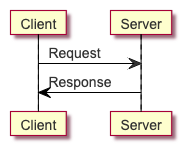

# NutUml
NutUml is A tool to generate UML diagram via text. For online preview you can visit [https://www.nutuml.com/](https://www.nutuml.com/)


## Get Start

We describe a sequence sample by:
```
Client -> Server : Request
Server -> Client : Response
```
You can use the follow Code to try. Remember download nutuml.js to your local.

```
<script src="nutuml.js"></script>
<div id="test"></div>
<script>
    var text = 'Client -> Server : Request\nServer -> Client : Response';
    document.getElementById("test").innerHTML = nutuml.render(text);
</script>
```

## React demo

```
npm i nutuml
```
React code

```
import nutuml from 'nutuml';

function App() {
  let img = nutuml.render('Client -> Server : Request\nServer -> Client : Response');
  return (
    <div dangerouslySetInnerHTML = {{ __html: img }}>
    </div>
  );
}
export default App;
```

for the code above, it will generate a picture as follow:



## Star is welcome

If this project make sense to you, please give me a star.

Thank you!
