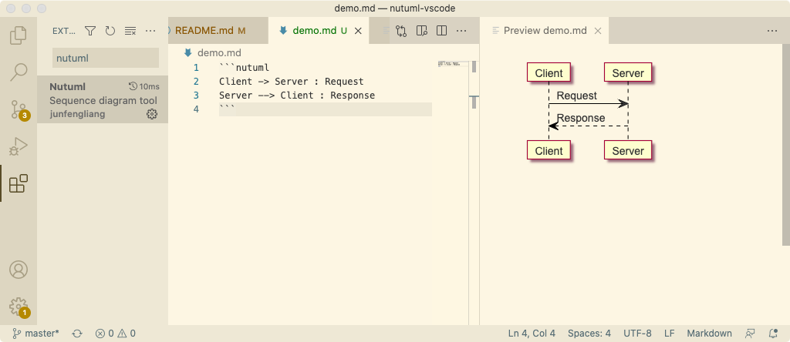
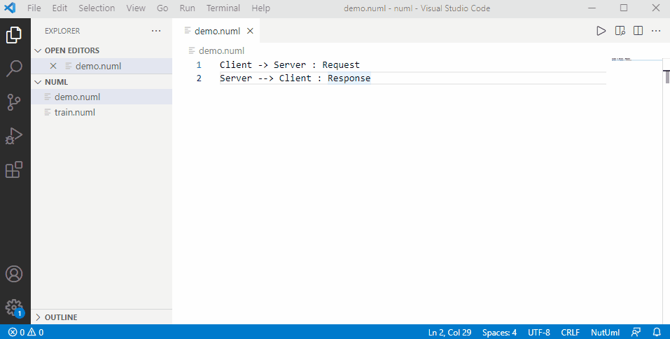
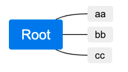

# Nutuml README

Nutuml is a tool for uml sequence  diargram. You can edit UML description text in vscode and preview the generated UML diagram in real time.

## Quick start

### Use Nutuml in markdown file

1. Create or open a markdown file with the suffix **.md**
2. Input uml description text, a demo as follow

<pre>
```nutuml
Client -> Server : Request
Server --> Client : Response
```
</pre>


1. Click the **Preview** button on the right top of the editor.

Below is a picture to show the demo.


### Use Nutuml in stand alone file 

1. Create or open a file with the suffix **.numl**
2. Input uml description text, a demo as follow

```
Client -> Server : Request
Server --> Client : Response
```

3. Click the **Preview** button on the right top of the editor.

Below is a gif to show the demo.




For more syntax reference. please refer to [nutuml homepage](https://www.nutuml.com/) 

### Mindmap support
1. Create or open a markdown file with the suffix **.md**
2. Input uml description text, a demo as follow

<pre>
```nutuml
# Root
## aa
## bb
## cc
```
</pre>


1. Click the **Preview** button on the right top of the editor.

Below is a picture to show the demo.


## Release Notes
### 0.6.0
1. support mindmap

### 0.5.0 
1. fix offset erro when participant is too long.

### 0.4.0
1. support nutuml in markdown

### 0.3.0
1. fix gif unable to show issue in readme.md
2. update nutuml core to 0.6.0

### 0.2.0
1. add Quick start in readme

### 0.1.0
1. upate nutuml to 0.5.0 to fix bug

**Enjoy!**