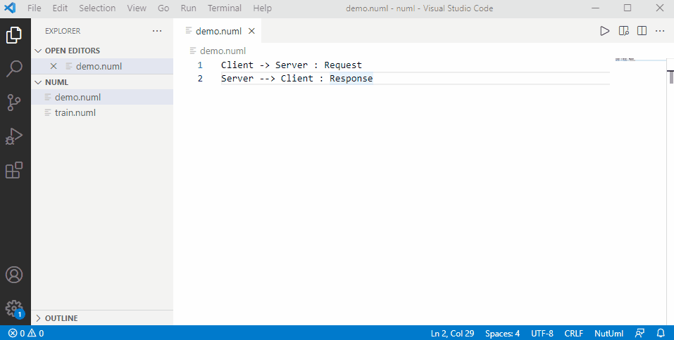

# Nutuml README

Nutuml is a tool for uml diargram. You can edit UML description text on the web page and view the generated UML diagram in real time.

## Quick start

1. Create or open a file with the suffix **.numl**
2. Input uml description text, a demo as follow

```
Client -> Server : Request
Server --> Client : Response
```

3. Click the **Preview** button on the right top of the editor.

Below is a gif to show the demo.



For more syntax reference. please refer to [nutuml homepage](https://www.nutuml.com/) 

## Release Notes
### 0.2.0
1. add Quick start in readme

### 0.1.0
1. upate nutuml to 0.5.0 to fix bug

### 0.0.2
1. Make preview picture in center
2. support preview change when text editor changed

### 0.0.1
4. Initial release of nutuml

-----------------------------------------------------------------------------------------------------------

**Enjoy!**